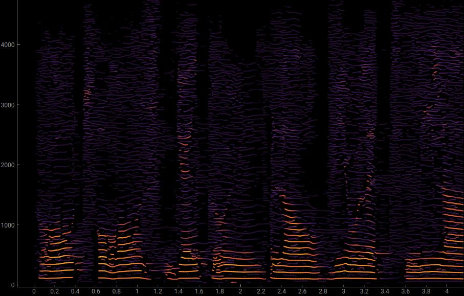

SNDTRCK
=======

Partial tracking in python 3



# Dependencies

## Mandatory

* python >= 3.7
* numpy
* [bpf4]: interpolation curves
* [sndfileio]: simple API for reading and writing sound-files
* [loristrck]: partial tracking analysis based on Loris. See the project for its own set of dependencies

## Optional but HIGHLY recommended

* [pyqtgraph]: efficient plotting via Qt 
* h5py: allows saving partial-tracking data as HDF5. You need to install hdf5.

# Installation

We assume that `pip` points to your current python >= 3.7 installation. Otherwise use `pip3` and `python3`

## Linux

    $ sudo apt-get install fftw-dev
    $ pip install -r requirements.txt [--user]
    $ git clone https://github.com/gesellkammer/sndtrck
    $ cd sndtrck
    $ python setup.py install [--user]
    
## OSX

    $ brew install fftw
    $ pip install -r requirements.txt [--user]
    $ git clone https://github.com/gesellkammer/sndtrck
    $ cd sndtrck
    $ python setup.py install

    
## Windows 

Follow instructions [here](http://www.fftw.org/install/windows.html))

    $ pip install -r requirements.txt
    $ git clone https://github.com/gesellkammer/sndtrck
    $ cd sndtrck
    $ python setup.py install

---

# Basic Usage

## Example 1

```python

import sndtrck
spectrum = sndtrck.analyze("/path/to/sndfile", resolution=50)

# Get the chord at 500ms, but only the partials louder than -30 dB
print(spectrum.chord_at(0.5, minamp=-30))
# [A3+, C5+10, E5-13]
spectrum.plot()
spectrum.show()  # this will show you the spectrum in the default applicatio for your system
spectrum.write("spectrum.sdif")
```

# Features

* analysis of sound-files in many formats
* automatic configuration of analysis parameters
* filtering of partials based on multiple criteria
* resynthesis
* plotting
* export the spectrum to many different formats (sdif, hdf5, midi) 

# Transcription

Go to [sndscribe] for automatic transcription of spectra into musical notation

[bpf4]: https://github.com/gesellkammer/bpf4
[loristrck]: https://github.com/gesellkammer/loristrck
[sndfileio]: https://github.com/gesellkammer/sndfileio
[pandas]: http://pandas.pydata.org/
[sndscribe]: https://github.com/gesellkammer/sndscribe
[pyqtgraph]: http://pyqtgraph.org

# License

GNU 
